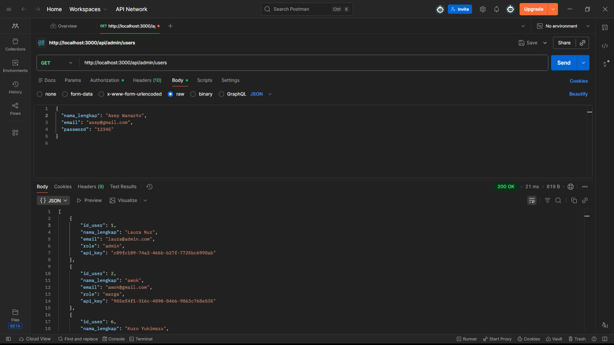
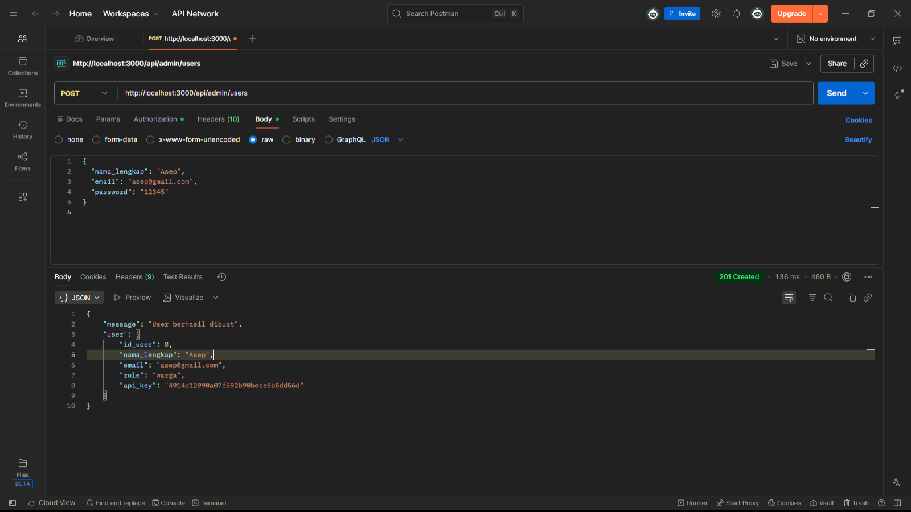
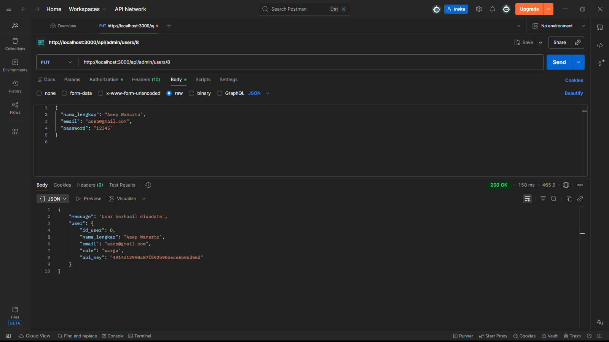

## Backend
## 1. Login

## 2. Register

## 3. Admin Get

## 4. Admin Post

## 5. Admin Put

## 6. Admin Delete

## Frontend
## 1. Login

## 2. Register

## 3. Halaman Home

## 4. Profil

## Arsitektur
